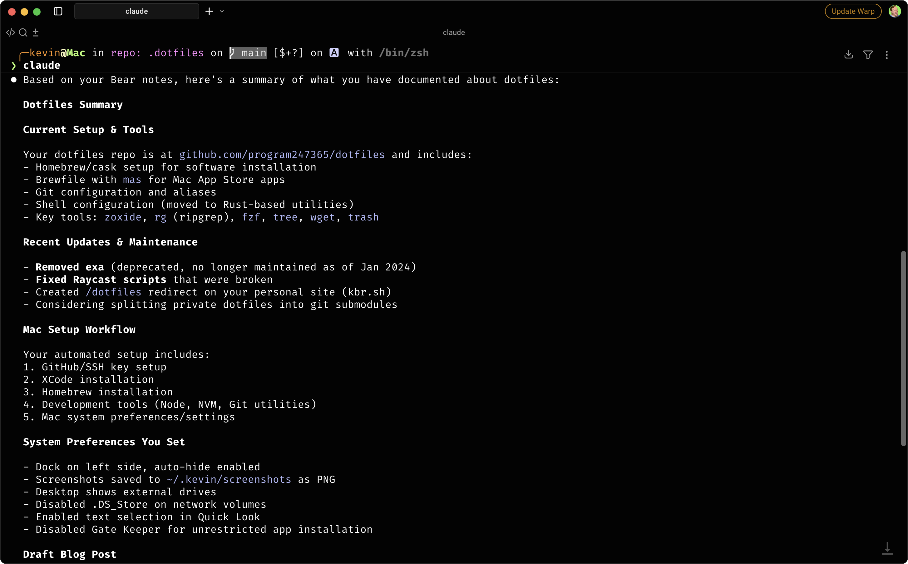

# 🐻 Bear Notes Skill

> A comprehensive Claude Code skill that brings the power of your [Bear](https://bear.app) notes directly into your development workflow.

Transform your personal knowledge base into an AI-powered assistant. Search, read, create, and update Bear notes seamlessly within Claude Code.



---

## ✨ Features

- 🔍 **Search notes** by text and tags with fuzzy matching
- 📅 **Filter by date** using Bear's native operators (@last7days, @today, @date(>2024-01-01), etc.)
- 📖 **Read full note content** with proper formatting preserved
- ✍️ **Create new notes** with tags and metadata
- 🔄 **Update existing notes** (append/prepend/replace)
- 🏷️ **List all tags** in your Bear database with hierarchy
- 🚀 **Open notes** directly in Bear app

## 📦 Installation

This skill is already set up in your dotfiles at `.claude/skills/bear-notes/`.

If you're setting this up manually:

```bash
# Clone or copy the skill to your Claude Code skills directory
cp -r bear-notes ~/.claude/skills/
```

## 🚀 Usage

Invoke the skill in Claude Code:

```bash
/skill bear-notes
```

Once activated, Claude has full access to your Bear notes and can:

1. ✅ Answer questions based on your notes
2. 🔎 Search across all your notes with context
3. 📝 Create new notes from conversations
4. ✏️ Update existing notes with new information
5. 🏷️ Suggest tags based on your existing structure

## 💡 Examples

**Search your notes:**
> "What notes do I have about Python?"

**Filter by date:**
> "Show me my work notes from the last 7 days"
> "Find notes I created today about meetings"
> "What did I write about Docker in October 2024?"

**Summarize notes:**
> "Summarize my notes about dotfiles"

### 📅 Date Filtering

The skill supports Bear's native date operators, making it easy to find notes by modification or creation date:

```bash
# Recent notes
python3 bear.py search "@last7days"
python3 bear.py search "@today"
python3 bear.py search "@yesterday"

# Date comparisons
python3 bear.py search "@date(>2024-10-01)"        # Modified after Oct 1
python3 bear.py search "@date(<2024-10-31)"        # Modified before Oct 31
python3 bear.py search "@date(2024-10-15)"         # Exact date

# Creation date filters
python3 bear.py search "@cdate(>2024-01-01)"       # Created in 2024
python3 bear.py search "@created30days"            # Created in last 30 days

# Combine with text and tags
python3 bear.py search "@last7days python" --tag projects
python3 bear.py search "@date(>2024-10-01) docker kubernetes"
```

You can also use explicit parameters instead of operators:

```bash
python3 bear.py search "kubernetes" \
  --modified-after 2024-10-01 \
  --modified-before 2024-10-31 \
  --tag work
```

**Create from conversation:**
> "Save this code snippet to Bear with tags programming and python"

**Context-aware assistance:**
> "Based on my meeting notes, what were the action items from last week?"

**Find links and references:**
> "Find all my notes that mention docker or kubernetes"

## ⚙️ How It Works

The skill uses two complementary methods to interact with Bear:

### 1. **SQLite Database** (Read-only)
   - Direct access to Bear's database for lightning-fast searching
   - Located at `~/Library/Group Containers/9K33E3U3T4.net.shinyfrog.bear/`
   - Supports both Bear v1 and v2
   - No network calls - completely local and private

### 2. **x-callback-url API** (Write operations)
   - Creates and modifies notes via Bear's official URL scheme
   - Uses `bear://x-callback-url/create`, `add-text`, etc.
   - Respects Bear's native features and formatting

## 🛠️ CLI Tool

The skill includes a standalone CLI tool at `bear.py` that can be used independently:

```bash
# Search notes
python3 bear.py search "query" --tag work --format json

# Search with date filters (Bear operators)
python3 bear.py search "@last7days python"
python3 bear.py search "@date(>2024-01-01) docker"
python3 bear.py search "@today meetings"

# Search with explicit date parameters
python3 bear.py search "kubernetes" --modified-after 2024-10-01 --modified-before 2024-10-31

# Read a specific note
python3 bear.py read 12345 --format markdown

# Create a note
python3 bear.py create --title "New Note" --text "Content" --tags "tag1,tag2"

# List all tags
python3 bear.py tags

# Add text to existing note
python3 bear.py add --id 12345 "Additional text" --mode append

# Open note in Bear
python3 bear.py open --id 12345 --edit
```

### CLI Options

**Search:**
- `--tag TAG` - Filter by tag
- `--format json|text|markdown` - Output format
- `--limit N` - Limit results
- `--modified-after YYYY-MM-DD` - Notes modified after date
- `--modified-before YYYY-MM-DD` - Notes modified before date
- `--created-after YYYY-MM-DD` - Notes created after date
- `--created-before YYYY-MM-DD` - Notes created before date

**Bear Date Operators (in query string):**
- `@date(YYYY-MM-DD)` - Exact modification date
- `@date(>YYYY-MM-DD)` - Modified after date
- `@date(<YYYY-MM-DD)` - Modified before date
- `@cdate(YYYY-MM-DD)` - Same operators for creation date
- `@today` - Modified today
- `@yesterday` - Modified yesterday
- `@ctoday` - Created today
- `@last7days` - Modified in last 7 days (any number)
- `@created7days` - Created in last 7 days (any number)

**Read:**
- `--format text|markdown|json` - Output format
- `--id ID` - Note ID to read

**Create:**
- `--title TITLE` - Note title
- `--text TEXT` - Note content
- `--tags TAGS` - Comma-separated tags
- `--pin` - Pin the note

## 📁 Architecture

Based on the Raycast Bear extension architecture:

```
bear-notes/
├── bear.py              # Python CLI tool (core functionality)
├── claudeskill.yaml     # Skill definition with tools and prompts
├── README.md            # This file
├── QUICKSTART.md        # Quick reference guide
├── img/
│   └── bear-notes-skill.png
├── .env.example         # Example environment configuration
└── .gitignore          # Git ignore rules
```

**Components:**
- **bear.py** - Python CLI tool equivalent to Raycast's bear-db.ts + API calls
- **claudeskill.yaml** - Skill definition that Claude Code uses
- **README.md** - Comprehensive documentation

## 📋 Requirements

- [Bear app](https://bear.app) installed on macOS (free or Bear Pro)
- Python 3.6+ (uses only standard library - no dependencies!)
- Bear database accessible (app must have been run at least once)
- macOS (Bear is macOS/iOS only)

## 🔒 Privacy & Security

Your notes stay private and secure:

- ✅ All operations are **100% local** (no external API calls)
- ✅ Direct database access is **read-only**
- ✅ Write operations go through Bear's **official URL scheme**
- ✅ No data is sent outside your machine
- ✅ No API keys or tokens required
- ✅ Works completely offline

## 🐛 Troubleshooting

### "Bear database not found"
- Ensure [Bear](https://bear.app) is installed and has been opened at least once
- Check that Bear has created its database
- Verify the path: `~/Library/Group Containers/9K33E3U3T4.net.shinyfrog.bear/`

### Search returns no results
- Verify notes aren't archived or trashed in Bear
- Try broader search terms
- Use `python3 bear.py tags` to verify tag names and structure

### Create note fails
- Ensure Bear is installed and running
- Check that URL scheme handlers are enabled in macOS System Preferences
- Try creating a note manually in Bear first to verify it's working

### Permission errors
- Grant Terminal/Claude Code full disk access in System Preferences > Security & Privacy > Privacy > Full Disk Access

## 🔧 Extending

You can extend the CLI tool by:

- 📎 Adding support for grabbing URLs (`grab-url` command)
- 🔗 Implementing backlinks/forward links search
- 📤 Adding export functionality (Markdown, HTML, PDF)
- 🔄 Creating batch operations for bulk updates
- 📊 Building analytics on your note-taking habits
- 🎨 Adding syntax highlighting for code blocks

## 🎯 Use Cases

- **Developer Knowledge Base**: Store code snippets, debugging notes, and TILs
- **Project Notes**: Keep project documentation synchronized with your development
- **Meeting Notes**: Reference action items and decisions during coding
- **Research**: Access technical research and bookmarks while coding
- **Learning**: Build a second brain for programming concepts and tutorials

## 📚 Related Projects

- [Bear](https://bear.app) - Beautiful writing app for notes and prose
- [Raycast Bear Extension](https://github.com/raycast/extensions/tree/main/extensions/bear) - Original inspiration
- [Claude Code](https://docs.claude.com/claude-code) - AI-powered coding assistant

## 🙏 Credits

Based on the excellent [Raycast Bear Extension](https://github.com/raycast/extensions/tree/main/extensions/bear) by [@hmarr](https://github.com/hmarr) and contributors.

Adapted for Claude Code by [@program247365](https://github.com/program247365).

## 📄 License

MIT License - feel free to use, modify, and distribute.

---

**Made with ❤️ for the Bear and Claude Code communities**
